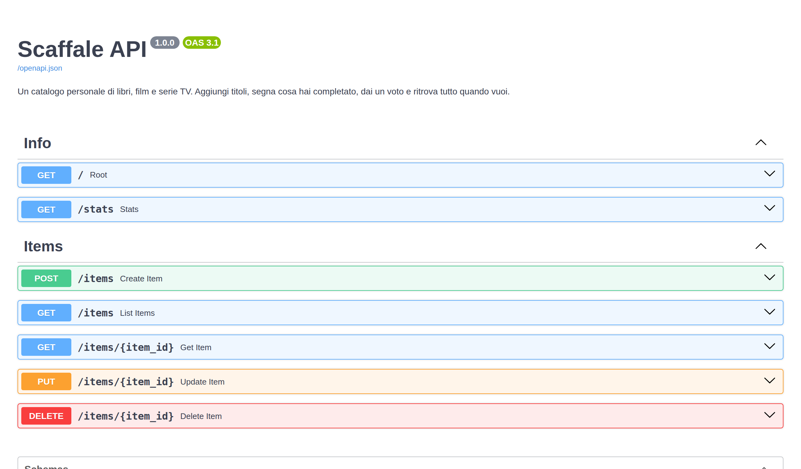

# 📚 Scaffale API

**Scaffale** è un'API REST per catalogare libri, film e serie TV: cosa hai letto o visto, cosa vuoi ancora recuperare, con quale voto lo ricordi. A differenza di Bussola e RestMenu, qui non c'è un'interfaccia grafica: è un servizio che espone dati tramite richieste HTTP, pensato per essere consumato da altre applicazioni (o provato direttamente dalla documentazione interattiva inclusa).

**🔗 Demo live:** _(da aggiungere dopo il deploy — vedi sezione "Deploy" più sotto)_

**📖 Documentazione interattiva:** una volta avviata, disponibile su `/docs` — permette di provare ogni endpoint direttamente dal browser, senza scrivere codice.



## Funzionalità

- **Aggiungi un titolo** — libro, film o serie, con autore/regista, stato (`da_iniziare`, `in_corso`, `completato`) e voto da 1 a 5.
- **Cerca e filtra** — per tipo, per stato, o per parola nel titolo.
- **Modifica e cancella** — aggiorna lo stato o il voto di un titolo, oppure rimuovilo dal catalogo.
- **Statistiche** — quanti titoli hai, suddivisi per tipo e stato, e il voto medio che assegni.
- **Documentazione automatica** — ogni endpoint è documentato e provabile da `/docs`, senza bisogno di Postman o altri strumenti.

## Endpoint principali

| Metodo | Endpoint | Cosa fa |
|---|---|---|
| `GET` | `/items` | Elenca i titoli (filtri opzionali: `type`, `status`, `q`) |
| `POST` | `/items` | Aggiunge un nuovo titolo |
| `GET` | `/items/{id}` | Dettaglio di un titolo |
| `PUT` | `/items/{id}` | Modifica un titolo |
| `DELETE` | `/items/{id}` | Rimuove un titolo |
| `GET` | `/stats` | Statistiche del catalogo |

### Esempio

```bash
curl -X POST http://localhost:8000/items \
  -H "Content-Type: application/json" \
  -d '{"title":"Il nome della rosa","type":"libro","creator":"Umberto Eco","status":"completato","rating":5}'
```

## Come è fatta

Costruita in **Python** con **FastAPI** e **SQLModel** (che unisce validazione dei dati e accesso al database), con **SQLite** come database. La documentazione interattiva (Swagger UI) è inclusa nel progetto stesso, così funziona anche senza connessione a servizi esterni.

## Provarla in locale

```bash
git clone https://github.com/8rrm7tvzcf-droid/scaffale-api.git
cd scaffale-api
python3 -m venv .venv
source .venv/bin/activate      # su Windows: .venv\Scripts\activate
pip install -r requirements.txt
uvicorn app.main:app --reload
```

Poi apri `http://localhost:8000/docs` nel browser per provare l'API.

## Deploy (Render)

1. Crea un nuovo **Web Service** su [render.com](https://render.com), collegato a questo repository.
2. **Build Command:** `pip install -r requirements.txt`
3. **Start Command:** `uvicorn app.main:app --host 0.0.0.0 --port $PORT`
4. Una volta online, la documentazione sarà su `https://<tuo-servizio>.onrender.com/docs`.

> Nota: usando il piano gratuito di Render il database SQLite viene azzerato a ogni riavvio del servizio — va benissimo per una demo, ma per dati persistenti servirebbe un database esterno (es. Postgres).
